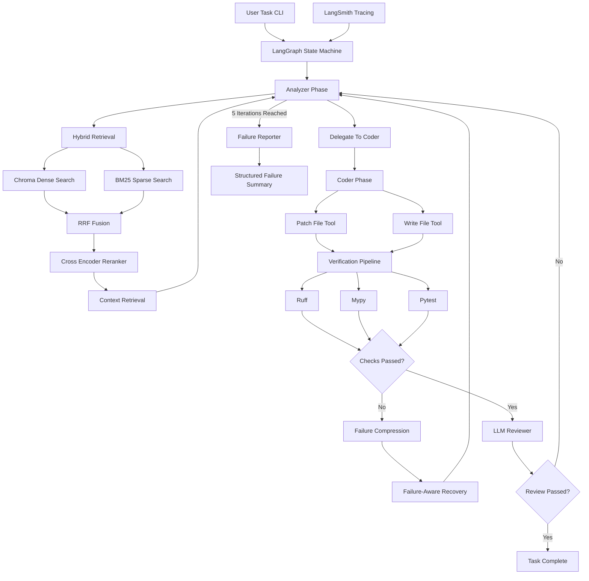
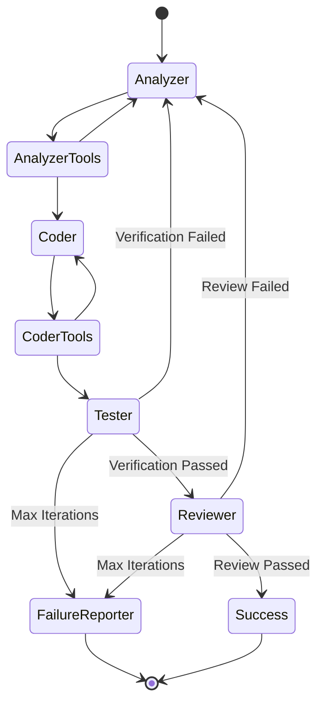
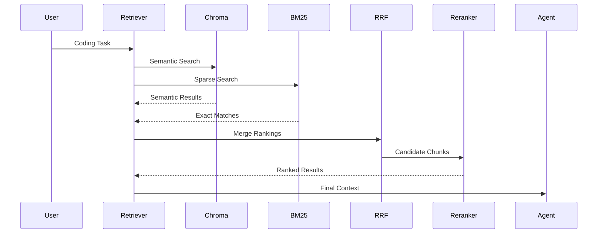

# Bindu — Retrieval-Augmented Coding Agent

> Deterministic Retrieval-Augmented Repository Repair Agent

---


# Real Repository Validation

The agent was validated against a real issue from the original Bindu open-source repository:

- Issue #522: https://github.com/GetBindu/Bindu/issues/522
- Real Issue Repair Trace: https://smith.langchain.com/public/c84f0a3f-2ec2-4bbe-93f0-8d4432c81767/r

The validation task involved:

- repository retrieval
- targeted code analysis
- patch generation
- verification execution
- iterative repair
- bounded recovery loops

This served as the primary real-world validation scenario for the system.

---

# Overview

Bindu is a deterministic multi-phase coding agent built using LangGraph.

The system accepts natural language coding tasks, retrieves relevant repository context using hybrid retrieval, generates repository patches, runs verification checks, performs iterative repair, and produces structured failure reports when recovery limits are exceeded.

The project intentionally prioritizes:

- deterministic execution
- inspectability
- bounded retries
- structured recovery
- verification gating
- tool isolation

over unconstrained autonomous behavior.

The goal was building a production-oriented coding workflow that safely modifies real repositories instead of generating isolated snippets.

---

# Architecture

## End-to-End System



---

# LangGraph Workflow



---

# Hybrid Retrieval Architecture

The retrieval layer combines:

- Dense semantic retrieval using ChromaDB embeddings
- Sparse lexical retrieval using BM25
- Reciprocal Rank Fusion (RRF)
- Cross-encoder reranking

This architecture improves retrieval quality while minimizing irrelevant context during repair iterations.

---

# Retrieval Pipeline



---

# Deterministic Multi-Phase Design

The system intentionally avoids unconstrained autonomous loops.

Instead, execution is divided into strict phases:

1. Analyzer Phase
2. Retrieval Phase
3. Coder Phase
4. Verification Phase
5. Review Phase
6. Failure Recovery Phase

Each phase has:

- isolated tools
- constrained responsibilities
- deterministic routing
- bounded retries

This improves:

- debugging visibility
- repair stability
- observability
- safety
- reproducibility

compared to unconstrained ReAct-style systems.

---

# Multi-Model Routing

The system routes tasks between specialized models.

| Phase | Primary Model | Fallback Model | Responsibility |
|---|---|---|---|
| Analyzer | Qwen 122B | Mistral Small | Retrieval orchestration + error analysis |
| Coder | Qwen 397B | Mistral Large | Patch generation + implementation |

---

# Fallback Model Routing

The system implements provider-level fallback chains.

Fallback routing protects execution against:

- provider outages
- free-tier instability
- rate limits
- timeout events

This architecture became especially important during development because several free-tier inference endpoints experienced intermittent outages.

---

# Tool Isolation Strategy

Each phase only receives the tools required for that stage.

## Analyzer Tools

- search_codebase
- read_file
- delegate_to_coder

## Coder Tools

- patch_file
- write_file

This prevents:

- uncontrolled repository mutation
- premature patching
- unrestricted retrieval during generation

The analyzer cannot modify files.
The coder cannot perform unrestricted repository retrieval.

---

# Verification Pipeline

The verification pipeline contains multiple layers.

## Static Analysis

- Ruff linting
- Mypy type checking

## Runtime Verification

- Pytest execution
- Existing repository tests

## LLM Review Layer

After all checks pass, an additional LLM reviewer performs:

- security inspection
- hallucination checks
- convention validation
- implementation sanity review

The task is only marked complete after all layers succeed.

---

# Failure Recovery

Instead of blindly retrying generation, the analyzer re-enters retrieval mode using failure-aware context.

Verification failures are compressed into structured recovery summaries before entering the next repair iteration.

The system also enforces:

- max iteration limits
- bounded retries
- structured failure reporting

to prevent infinite repair loops.

---

# LangSmith Observability

The system integrates with LangSmith for execution tracing and debugging.

Traced components include:

- analyzer phase
- retrieval operations
- reranking flow
- tool execution
- verification pipeline
- repair loops
- reviewer stage
- failure reporting

LangSmith traces were heavily used during debugging of:

- repeated retrieval duplication
- unstable repair loops
- verification failures
- incorrect failure categorization

---

# Evaluation Status

A full automated benchmark suite was designed but not fully executed due to prolonged provider outages and free-tier rate limits during development.

However, the following components were fully implemented:

- deterministic LangGraph execution
- hybrid retrieval pipeline
- reranking architecture
- verification pipeline
- iterative repair loops
- bounded retry handling
- fallback model routing
- LLM review stage
- LangSmith observability

The system was successfully validated against a real-world issue from the original Bindu repository.

Planned evaluation harness architecture and benchmark tasks are included in the repository.

---

# Planned Evaluation Tasks

| Task | Category |
|---|---|
| Fix incorrect type annotation | Bug Fix |
| Add validation for empty config values | Validation |
| Fix failing import in test module | Repair |
| Refactor duplicate normalization logic | Refactor |
| Add pytest coverage for invalid tokens | Test Generation |
| Add optional timeout parameter | Multi-step Repair |
| Update CLI parser for multiple tasks | Complex Modification |
| Impossible constraint task | Safe Failure Handling |

---

# Production-Oriented Design Decisions

The system intentionally prioritizes:

- deterministic execution
- bounded retries
- inspectability
- structured recovery
- verification gating
- observability

over unconstrained autonomous behavior.

The goal was building a debuggable repository repair workflow suitable for production engineering environments.

---

# What Broke First

The first major issue was uncontrolled repair loops.

Early versions repeatedly generated nearly identical failing patches because retrieval context was not sufficiently failure-aware.

This caused:

- repeated failing implementations
- unstable repair behavior
- redundant retrieval cycles

The fix involved:

- deterministic phase routing
- failure-aware retrieval refinement
- compressed failure summaries
- iteration limits
- structured reviewer feedback

LangSmith traces were heavily used during this debugging process.

---

# Current Limitations

- Full benchmark execution was limited by provider instability
- Cost tracking is runtime-based rather than token-accurate
- Retrieval is chunk-based rather than AST-aware
- The repair loop is deterministic rather than parallelized

---

# Repository Structure

```bash
project/
├── main.py
├── tools.py
├── ingest.py
├── eval/
├── reports/
├── vector_store/
├── bindu_bm25_index.pkl
└── assets/
```

---

# Setup

## Install Dependencies

```bash
uv sync
```

---

# Environment Variables

```bash
NVIDIA_API_KEY=
MISTRAL_API_KEY=
LANGCHAIN_API_KEY=
LANGCHAIN_PROJECT=
LANGCHAIN_TRACING_V2=true
```

---

# Repository Ingestion

```bash
python ingest.py
```

---

# Run Agent

```bash
python main.py --task "Fix failing import in test module"
```

---

# Planned Eval Harness

```bash
python eval/run_eval.py
```
